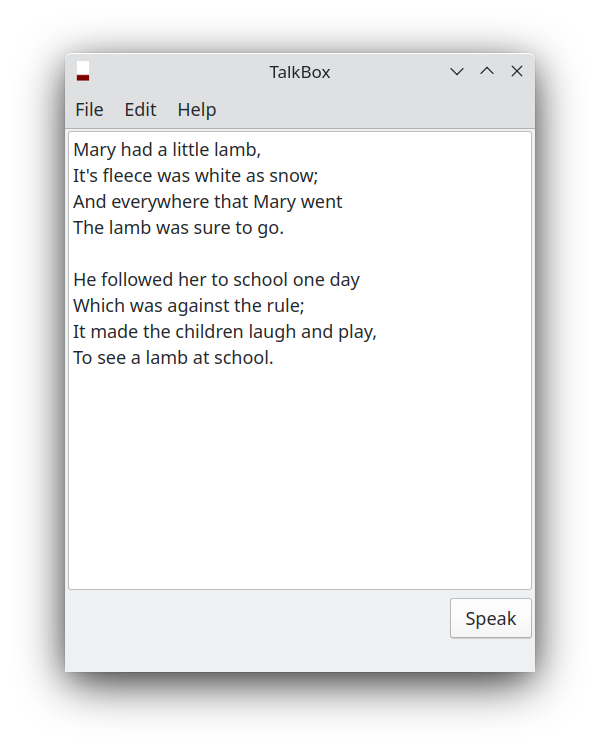

# TalkBox

TalkBox is a Linux text reader which uses a built-in diphone speech synthesiser. It has been developed using C++ and [Qt5.15](https://doc.qt.io/qt-5/lgpl.html).

A screenshot of TalkBox is shown below.



## Deployment

### Prebuilt Binary

A 64 bit prebuilt binary for TalkBox is available and can be downloaded from [here](https://github.com/crispinalan/talkbox/tree/main/app-binary).

You first need to ensure that all the required packages for a Qt app are installed on your distro. With many KDE distros such as [Kubuntu](https://kubuntu.org/), [KaOS](https://kaosx.us/), [Siduction KDE](https://siduction.org/), [KDE Neon](https://neon.kde.org/) the Qt5 libraries are installed by default and you just need to double click on the TalkBox executable to run it once extracted.

The extracted directory contains the diphone and sounds folders together with the TalkBox executable.

If TalkBox does not execute by double clicking on the binary file then make sure that it has executable permissions. Right click on it and check properties.

## Using TalkBox

Using TalkBox is straightforward. Either type or paste some text into the text area or open a text file and then press the speak button.

A demo text file called mary.txt is included in the app image download.

## Speech Dictionary

TalkBox has a small dictionary of approximately 56,600 English words.  If a word is not recognised by the dictionary it is skipped over. More words will be added in future updates.

### How is speech generated?

Speech is generated using a diphone speech synthesiser. Words are formed as sequences of elementary speech units known as diphones. The diphone folder should be placed into the application binary (executable) working directory.

The first attempt at a speech engine was based around a phoneme speech synthesiser to create an artificial voice by means of concatenating phoneme wav files. A phoneme is the smallest unit of sound that distinguishes one word from another word and there are 44 phonemes in the English language. This produced very poor synthesised speech. I experimented with a formant speech synthesiser but again I could not get satisfactory results. For anyone interested in formant speech synthesis I have put the development code on github [formant speech synthesiser](https://github.com/crispinalan/formant-synthesizer). The current version of TalkBox uses a diphone speech synthesiser which vocalises speech by means of concatenating diphone wav files. A diphone is a sound unit composed of two adjacent partial phonemes i.e. the second half of the first phoneme and the first half of the second phoneme.

It is important to note that TalkBox does not use speech synthesisers available in Linux distributions (e.g. Flite and espeak) and installed using package managers. The big issue with using these external speech synthesisers is that different Linux distributions are using different versions. Also when you combine software to produce a larger work both licenses should be compatible. This is relevant with regard to combining TalkBox with an external speech synthesiser.  Open source licenses and their compatibility is discussed in this [article](https://janelia-flyem.github.io/licenses.html) and [here](https://www.gnu.org/licenses/gpl-faq.en.html).  Unbelievably, some open source licences are just not compatible with each other as discussed in this video [Compatibility in Open Source Licenses](https://www.youtube.com/watch?v=B0aMYeMv-8I) and so cannot be used together (e.g. the Apache 2.0 license is not compatible with the GPLv2 licenses). TalkBox uses it own built-in speech engine and does not reply on installing an external speech synthesiser.

## Compiling Source Code

The C++ Qt source code is provided in the src folder.

Talk Calendar uses cmake for the build system and the GNU C++ compiler. With Ubuntu you need to install:

```
sudo apt update
sudo apt install build-essential
sudo apt install cmake
```

You need to ensure that all the required packages for developing a Qt app are installed (e.g. with Ubuntu qtbase5-dev, qt5multimedia5-dev, mesa-common-dev etc.).


### Building

To build from source use the terminal commands:

```
mkdir build
cd build
cmake ..
make
```
Copy the diphone and sound folders (in the app image download) to the build folder. To run TalkBox from the terminal use:

```
./talkbox
```

On Linux, audio output requires that the alsa-utils package is installed (this is usually installed by default).


## Versioning

[SemVer](http://semver.org/) is used for versioning. The version number has the form 0.0.0 representing major, minor and bug fix changes.

Any bugs found will be fixed and the version number updated accordingly. TalkBox starts at version zero.

## Author

* **Alan Crispin** [Github](https://github.com/crispinalan)


## License

TalkBox Qt is licensed under GPL v3.0.


## Acknowledgements

* Qt is a software development framework for cross-platform development and is available under the GNU Lesser General Public License [version 3](https://doc.qt.io/qt-5/lgpl.html). The Qt Company have recently released the Qt 5.15.6 LTS version as [open-source](https://www.phoronix.com/news/Qt-5.15.6-LTS-Open-Source).

* [Diphone Source and License](https://github.com/hypnaceae/DiphoneSynth/blob/master/diphones_license.txt)

* Diphone collection and synthesis Alan W. Black and Kevin Lenzo [2000](https://www.cs.cmu.edu/~awb/papers/ICSLP2000_diphone/index.html.)


